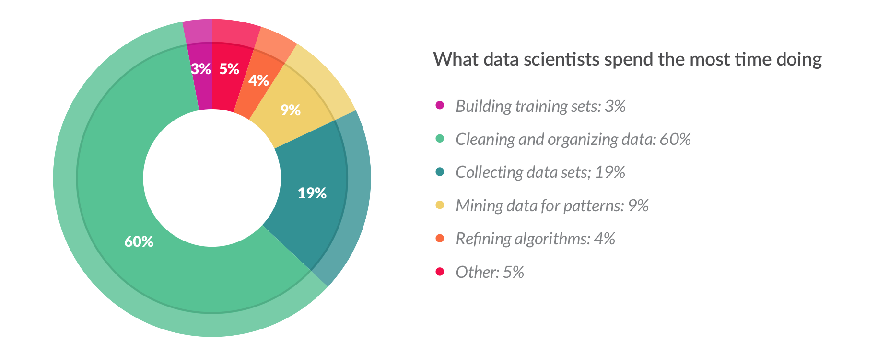
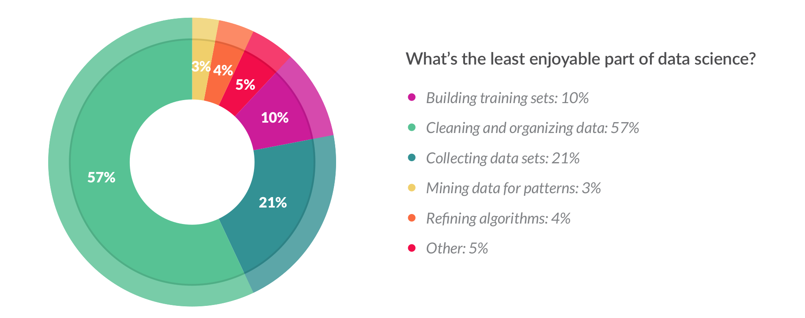

# Data Cleaning with NumPy and Pandas

[](http://snyk.io/test/github/mramshaw/Data-Cleaning?style=plastic&targetFile=requirements.txt)

> let’s be honest, the vast majority of time a data scientist spends is not doing all the really cool modeling that we all wanna do,
> it’s doing the data prep, the manipulation, reporting, graphing… That’s 80%-90% of the job now.

    Jared Lander - http://changelog.com/practicalai/7

Shamelessly stolen from the [CrowdFlower 2016 survey](http://visit.figure-eight.com/rs/416-ZBE-142/images/CrowdFlower_DataScienceReport_2016.pdf):



> The things data scientists do most are the things they enjoy least.

From the same survey:



[Note that the above graphics are based upon a __2016__ survey.]

At meetups, I have heard at least one data scientist say that most of their time is
spent cleaning data so when I ran across this great
[RealPython article](http://realpython.com/python-data-cleaning-numpy-pandas/)
I decided to try it out (the article suggests about 80% of a data scientists
 time is spent cleaning data).

The recommendation is to use Jupyter notebooks but I chose to use IPython.

I also created a batch version for fun: [winston_wolfe.py](winston_wolfe.py)

## Other Terms

___Data Cleaning___ is also referred to as ___Data Wrangling___,
___Data Munging___, ___Data Janitor Work___ and ___Data Preparation___.
All of these refer to preparing data for ingestion into a data processing
stream of some kind. Computers are very intolerant of format differences,
so all of the data must be reformatted to conform to a standard
(or "clean") format. Missing data and partial datasets can be
problematic, so an initial goal is to identify data deficiencies
before they lead to spurious results.

[Sometimes it is not mentioned at all, merely ___implied___.
 It is generally not possible to carry out an __ETL__ (Extract,
 Transform and Load) job without doing at least ___some___
 data cleaning. If you are asked for a time estimate for an ETL
 job, remember to factor in time for data examination & data
 cleaning. Not to mention how to handle [outliers](http://en.wikipedia.org/wiki/Outlier)
 (drop or not? if so, what is a good cutoff point? etc.).]

Other requirements may including ___normalizing___ data sets,
which generally means scaling the data to values between 0 and 1
(this enables certain types of numerical analysis).

The end result may sometimes be referred to as ___tidy data___,
however it is important to remember that data cleaning is not
always a one-time task. The further use of any given dataset
may well highlight details that need further cleaning.

## Exploration

Lets start with our first dataset.

The first thing is to have a look at the data. Here we will use the `head()`
command to inspect the first 5 records of our input file (`head` is an old
\*nix command meaning show the ___head___ of the specified file; and the `\`
character has long been used in \*nix as a continuation character; here the
data columns are broken up so as to not overflow the available screen width):

``` Python
>>> import pandas as pd
>>> import numpy as np
>>> df = pd.read_csv('Datasets/BL-Flickr-Images-Book.csv')
>>> df.head()
   Identifier             Edition Statement      Place of Publication  \
0         206                           NaN                    London   
1         216                           NaN  London; Virtue & Yorston   
2         218                           NaN                    London   
3         472                           NaN                    London   
4         480  A new edition, revised, etc.                    London   

  Date of Publication              Publisher  \
0         1879 [1878]       S. Tinsley & Co.   
1                1868           Virtue & Co.   
2                1869  Bradbury, Evans & Co.   
3                1851          James Darling   
4                1857   Wertheim & Macintosh   

                                               Title     Author  \
0                  Walter Forbes. [A novel.] By A. A      A. A.   
1  All for Greed. [A novel. The dedication signed...  A., A. A.   
2  Love the Avenger. By the author of “All for Gr...  A., A. A.   
3  Welsh Sketches, chiefly ecclesiastical, to the...  A., E. S.   
4  [The World in which I live, and my place in it...  A., E. S.   

                                   Contributors  Corporate Author  \
0                               FORBES, Walter.               NaN   
1  BLAZE DE BURY, Marie Pauline Rose - Baroness               NaN   
2  BLAZE DE BURY, Marie Pauline Rose - Baroness               NaN   
3                   Appleyard, Ernest Silvanus.               NaN   
4                           BROOME, John Henry.               NaN   

   Corporate Contributors Former owner  Engraver Issuance type  \
0                     NaN          NaN       NaN   monographic   
1                     NaN          NaN       NaN   monographic   
2                     NaN          NaN       NaN   monographic   
3                     NaN          NaN       NaN   monographic   
4                     NaN          NaN       NaN   monographic   

                                          Flickr URL  \
0  http://www.flickr.com/photos/britishlibrary/ta...   
1  http://www.flickr.com/photos/britishlibrary/ta...   
2  http://www.flickr.com/photos/britishlibrary/ta...   
3  http://www.flickr.com/photos/britishlibrary/ta...   
4  http://www.flickr.com/photos/britishlibrary/ta...   

                            Shelfmarks  
0    British Library HMNTS 12641.b.30.  
1    British Library HMNTS 12626.cc.2.  
2    British Library HMNTS 12625.dd.1.  
3  British Library HMNTS 10369.bbb.15.  
4     British Library HMNTS 9007.d.28.  
>>>
```

[For more data use `head(10)` instead.]

## Disposal

Now lets gets rid of any columns we don't need:

``` Python
>>> to_drop = ['Edition Statement',
...            'Corporate Author',
...            'Corporate Contributors',
...            'Former owner',
...            'Engraver',
...            'Contributors',
...            'Issuance type',
...            'Shelfmarks']
>>> df.drop(to_drop, inplace=True, axis=1)
>>> df.head()
   Identifier      Place of Publication Date of Publication  \
0         206                    London         1879 [1878]   
1         216  London; Virtue & Yorston                1868   
2         218                    London                1869   
3         472                    London                1851   
4         480                    London                1857   

               Publisher                                              Title  \
0       S. Tinsley & Co.                  Walter Forbes. [A novel.] By A. A   
1           Virtue & Co.  All for Greed. [A novel. The dedication signed...   
2  Bradbury, Evans & Co.  Love the Avenger. By the author of “All for Gr...   
3          James Darling  Welsh Sketches, chiefly ecclesiastical, to the...   
4   Wertheim & Macintosh  [The World in which I live, and my place in it...   

      Author                                         Flickr URL  
0      A. A.  http://www.flickr.com/photos/britishlibrary/ta...  
1  A., A. A.  http://www.flickr.com/photos/britishlibrary/ta...  
2  A., A. A.  http://www.flickr.com/photos/britishlibrary/ta...  
3  A., E. S.  http://www.flickr.com/photos/britishlibrary/ta...  
4  A., E. S.  http://www.flickr.com/photos/britishlibrary/ta...  
>>>
```

And now we are down to six columns.

The article suggests that if you know in advance which columns you’d like to use,
another option is to pass them to the `usecols` argument of `pd.read_csv`.

## Indexing

While we are now down to six columns, if we were to write this file now we would
see that `pandas` has prepended an index to each and every entry. It looks like
the `Identifier` column is unique, let's check this:

``` Python
>>> df['Identifier'].is_unique
True
>>>
```

Okay, it looks like we can use this column as an index:

``` Python
>>> df = df.set_index('Identifier')
>>> df.head()
                Place of Publication Date of Publication  \
Identifier                                                 
206                           London         1879 [1878]   
216         London; Virtue & Yorston                1868   
218                           London                1869   
472                           London                1851   
480                           London                1857   

                        Publisher  \
Identifier                          
206              S. Tinsley & Co.   
216                  Virtue & Co.   
218         Bradbury, Evans & Co.   
472                 James Darling   
480          Wertheim & Macintosh   

                                                        Title     Author  \
Identifier                                                                 
206                         Walter Forbes. [A novel.] By A. A      A. A.   
216         All for Greed. [A novel. The dedication signed...  A., A. A.   
218         Love the Avenger. By the author of “All for Gr...  A., A. A.   
472         Welsh Sketches, chiefly ecclesiastical, to the...  A., E. S.   
480         [The World in which I live, and my place in it...  A., E. S.   

                                                   Flickr URL  
Identifier                                                     
206         http://www.flickr.com/photos/britishlibrary/ta...  
216         http://www.flickr.com/photos/britishlibrary/ta...  
218         http://www.flickr.com/photos/britishlibrary/ta...  
472         http://www.flickr.com/photos/britishlibrary/ta...  
480         http://www.flickr.com/photos/britishlibrary/ta...  
>>>
```

Yep, that works.

The article now points out that Pandas Indexes do not make any guarantees of uniqueness,
although many indexing and merging operations will run faster if the Index __is__ unique.

We can now use `loc[]` to do key-based locating:

``` Python
>>> df.loc[216]
Place of Publication                             London; Virtue & Yorston
Date of Publication                                                  1868
Publisher                                                    Virtue & Co.
Title                   All for Greed. [A novel. The dedication signed...
Author                                                          A., A. A.
Flickr URL              http://www.flickr.com/photos/britishlibrary/ta...
Name: 216, dtype: object
>>>
```

Or we could use `iloc[]` to access our entries by index (instead of by key):

``` Python
>>> df.iloc[1]
Place of Publication                             London; Virtue & Yorston
Date of Publication                                                  1868
Publisher                                                    Virtue & Co.
Title                   All for Greed. [A novel. The dedication signed...
Author                                                          A., A. A.
Flickr URL              http://www.flickr.com/photos/britishlibrary/ta...
Name: 216, dtype: object
>>>
```

We could also have set our index __in-place__:

``` Python
df.set_index('Identifier', inplace=True)
```

Instead of:

``` Python
>>> df = df.set_index('Identifier')
```

## Cleaning up data fields

Lets see what datatypes we have:

``` Python
>>> df.get_dtype_counts()
object    6
dtype: int64
>>>
```
Okay, so lets check for formatting issues:

``` Python
>>> df.loc[1905:, 'Date of Publication'].head(10)
Identifier
1905           1888
1929    1839, 38-54
2836           1897
2854           1865
2956        1860-63
2957           1873
3017           1866
3131           1899
4598           1814
4884           1820
Name: Date of Publication, dtype: object
>>>
```

And we will need to clean up 'Date of Publication'. So we will
use a regular expression to extract our cleaned values:

``` Python
>>> regex = r'^(\d{4})'
>>> extr = df['Date of Publication'].str.extract(r'^(\d{4})', expand=False)
>>> extr.head()
Identifier
206    1879
216    1868
218    1869
472    1851
480    1857
Name: Date of Publication, dtype: object
>>>
```

Now lets convert these to a numeric type and copy them back:

``` Python
>>> df['Date of Publication'] = pd.to_numeric(extr)
>>> df['Date of Publication'].dtype
dtype('float64')
>>>
```

Note that floats have a decimal portion, which can look a little weird:

``` Python
>>> df['Date of Publication'].head()
Identifier
206    1879.0
216    1868.0
218    1869.0
472    1851.0
480    1857.0
Name: Date of Publication, dtype: float64
>>>
```

So far we have just used `pandas`, lets move on to using `numpy`.

## More cleaning up data fields (this time with `numpy`)

Lets have a look at our 'Place of Publication':

``` Python
>>> df['Place of Publication'].head(10)
Identifier
206                                  London
216                London; Virtue & Yorston
218                                  London
472                                  London
480                                  London
481                                  London
519                                  London
667     pp. 40. G. Bryan & Co: Oxford, 1898
874                                 London]
1143                                 London
Name: Place of Publication, dtype: object
>>>
```

Lets see if we can isolate London:

``` Python
>>> pub = df['Place of Publication']
>>> london = pub.str.contains('London')
>>> london[:5]
Identifier
206    True
216    True
218    True
472    True
480    True
Name: Place of Publication, dtype: bool
>>>
```

Lets add Oxford and clean them both up:

``` Python
>>> oxford = pub.str.contains('Oxford')
>>> df['Place of Publication'] = np.where(london, 'London',
...                                       np.where(oxford, 'Oxford',
...                                                pub.str.replace('-', ' ')))
>>> df['Place of Publication'].head()
Identifier
206    London
216    London
218    London
472    London
480    London
Name: Place of Publication, dtype: object
>>>
```

We *could* clean up leading and trailing whitespace with something like the following:


``` Python
df["Publisher"] = df["Publisher"].map(str.strip)
```

But simpler still to strip these on ingress:

``` Python
df = pd.read_csv('Datasets/BL-Flickr-Images-Book.csv', skipinitialspace=True)
```

## Destructuring data

On to the second dataset.

The `university_towns.txt` dataset is heavily-structured.

```
$ head Datasets/university_towns.txt
Alabama[edit]
Auburn (Auburn University)[1]
Florence (University of North Alabama)
Jacksonville (Jacksonville State University)[2]
Livingston (University of West Alabama)[2]
Montevallo (University of Montevallo)[2]
Troy (Troy University)[2]
Tuscaloosa (University of Alabama, Stillman College, Shelton State)[3][4]
Tuskegee (Tuskegee University)[5]
Alaska[edit]
$
```

We can destructure it as follows:

``` Python
>>> university_towns = []
>>> with open('Datasets/university_towns.txt') as file:
...     for line in file:
...         if '[edit]' in line:
...             # Remember this `state` until the next is found
...             state = line
...         else:
...             # Otherwise, we have a city; keep `state` as last-seen
...             university_towns.append((state, line))
... 
>>> university_towns[:5]
[('Alabama[edit]\n', 'Auburn (Auburn University)[1]\n'), ('Alabama[edit]\n', 'Florence (University of North Alabama)\n'), ('Alabama[edit]\n', 'Jacksonville (Jacksonville State University)[2]\n'), ('Alabama[edit]\n', 'Livingston (University of West Alabama)[2]\n'), ('Alabama[edit]\n', 'Montevallo (University of Montevallo)[2]\n')]
>>>
```

And now we can create a dataframe:

``` Python
>>> towns_df = pd.DataFrame(university_towns,
...                         columns=['State', 'RegionName'])
>>> towns_df.head()
             State                                         RegionName
0  Alabama[edit]\n                    Auburn (Auburn University)[1]\n
1  Alabama[edit]\n           Florence (University of North Alabama)\n
2  Alabama[edit]\n  Jacksonville (Jacksonville State University)[2]\n
3  Alabama[edit]\n       Livingston (University of West Alabama)[2]\n
4  Alabama[edit]\n         Montevallo (University of Montevallo)[2]\n
>>>
```

Lets create a function to clean up our data cells:

``` Python
>>> def get_citystate(item):
...     if ' (' in item:
...         return item[:item.find(' (')]
...     elif '[' in item:
...         return item[:item.find('[')]
...     else:
...         return item
... 
>>> towns_df =  towns_df.applymap(get_citystate)
>>> towns_df.head()
     State    RegionName
0  Alabama        Auburn
1  Alabama      Florence
2  Alabama  Jacksonville
3  Alabama    Livingston
4  Alabama    Montevallo
>>>
```

[We could also do something about quotes (`"`) but that would expose the embedded commas (`,`)
 and this would be a bigger problem.]

The article points out that the `applymap()` method will have a significant performance impact,
and that if performance ___is___ a consideration, this type of thing should be submitted to
`numpy` instead (in general, equivalent operations in numpy will significantly out-perform
native Python).

## Dropping rows and renaming columns

And now our third dataset. Lets see what we've got:

```
$ head -n 5 Datasets/olympics.csv
0,1,2,3,4,5,6,7,8,9,10,11,12,13,14,15
,? Summer,01 !,02 !,03 !,Total,? Winter,01 !,02 !,03 !,Total,? Games,01 !,02 !,03 !,Combined total
Afghanistan (AFG),13,0,0,2,2,0,0,0,0,0,13,0,0,2,2
Algeria (ALG),12,5,2,8,15,3,0,0,0,0,15,5,2,8,15
Argentina (ARG),23,18,24,28,70,18,0,0,0,0,41,18,24,28,70
$
```

Lets read it in:

``` Python
>>> olympics_df = pd.read_csv('Datasets/olympics.csv')
>>> olympics_df.head()
                   0         1     2     3     4      5         6     7     8  \
0                NaN  ? Summer  01 !  02 !  03 !  Total  ? Winter  01 !  02 !   
1  Afghanistan (AFG)        13     0     0     2      2         0     0     0   
2      Algeria (ALG)        12     5     2     8     15         3     0     0   
3    Argentina (ARG)        23    18    24    28     70        18     0     0   
4      Armenia (ARM)         5     1     2     9     12         6     0     0   

      9     10       11    12    13    14              15  
0  03 !  Total  ? Games  01 !  02 !  03 !  Combined total  
1     0      0       13     0     0     2               2  
2     0      0       15     5     2     8              15  
3     0      0       41    18    24    28              70  
4     0      0       11     1     2     9              12  
>>>
```

That first row looks pretty useless. So maybe drop it:

``` Python
>>> olympics_df = pd.read_csv('Datasets/olympics.csv', header=1)
>>> olympics_df.head()
                Unnamed: 0  ? Summer  01 !  02 !  03 !  Total  ? Winter  \
0        Afghanistan (AFG)        13     0     0     2      2         0   
1            Algeria (ALG)        12     5     2     8     15         3   
2          Argentina (ARG)        23    18    24    28     70        18   
3            Armenia (ARM)         5     1     2     9     12         6   
4  Australasia (ANZ) [ANZ]         2     3     4     5     12         0   

   01 !.1  02 !.1  03 !.1  Total.1  ? Games  01 !.2  02 !.2  03 !.2  \
0       0       0       0        0       13       0       0       2   
1       0       0       0        0       15       5       2       8   
2       0       0       0        0       41      18      24      28   
3       0       0       0        0       11       1       2       9   
4       0       0       0        0        2       3       4       5   

   Combined total  
0               2  
1              15  
2              70  
3              12  
4              12  
>>>
```

That's better. Now lets rename some columns:

``` Python
>>> new_names = {'Unnamed: 0': 'Country',
...              '? Summer': 'Summer Olympics',
...              '01 !': 'Gold',
...              '02 !': 'Silver',
...              '03 !': 'Bronze',
...              '? Winter': 'Winter Olympics',
...              '01 !.1': 'Gold.1',
...              '02 !.1': 'Silver.1',
...              '03 !.1': 'Bronze.1',
...              '? Games': '# Games',
...              '01 !.2': 'Gold.2',
...              '02 !.2': 'Silver.2',
...              '03 !.2': 'Bronze.2'}
>>> olympics_df.rename(columns=new_names, inplace=True)
>>> olympics_df.head()
                   Country  Summer Olympics  Gold  Silver  Bronze  Total  \
0        Afghanistan (AFG)               13     0       0       2      2   
1            Algeria (ALG)               12     5       2       8     15   
2          Argentina (ARG)               23    18      24      28     70   
3            Armenia (ARM)                5     1       2       9     12   
4  Australasia (ANZ) [ANZ]                2     3       4       5     12   

   Winter Olympics  Gold.1  Silver.1  Bronze.1  Total.1  # Games  Gold.2  \
0                0       0         0         0        0       13       0   
1                3       0         0         0        0       15       5   
2               18       0         0         0        0       41      18   
3                6       0         0         0        0       11       1   
4                0       0         0         0        0        2       3   

   Silver.2  Bronze.2  Combined total  
0         0         2               2  
1         2         8              15  
2        24        28              70  
3         2         9              12  
4         4         5              12  
>>>
```

Much better! Note that we have added postscripts to our repeated columns (Gold,
Silver, Bronze) so that each column is unique within the dataframe.

And thus ends the tutorial on cleaning data with Python.

## Python and pydoc

Some great stuff on documenting Python code here:

    http://realpython.com/documenting-python-code/

Lets clean up the code comments so that `pydoc` displays cleanly:

```
Help on module winston_wolfe:

NAME
    winston_wolfe - A quick and dirty 'cleaner' for some data files.

FILE
    /home/owner/Documents/Python/Data Cleaning/winston_wolfe.py

DESCRIPTION
    Three datasets will be cleaned, with cells reformatted as needed.

FUNCTIONS
    get_citystate(item)
        A function to clean up data cells.

DATA
    DF =            Place of Publication  Date of Publica...s/britishlibra...
    EXTRACT = Identifier
    206        1879
    216        1868
    218  ... Date of ...
    LONDON = Identifier
    206         True
    216         True
    218...: Place of...
    NEW_NAMES = {'01 !': 'Gold', '01 !.1': 'Gold.1', '01 !.2': 'Gold.2', '...
    OLYMPICS_DF =                                           Countr...  607...
    OXFORD = Identifier
    206        False
    216        False
    218...: Place of...
    PUB = Identifier
    206                     London
    216   ...Place of Publ...
    TOWNS_DF =              State                    RegionName...        ...
    TO_DROP = ['Edition Statement', 'Corporate Author', 'Corporate Contrib...
    UNIVERSITY_TOWNS = [('Alabama[edit]\n', 'Auburn (Auburn University)[1]...
    line = 'Laramie (University of Wyoming)[5]\n'
    state = 'Wyoming[edit]\n'
    towns = <closed file 'Datasets/university_towns.txt', mode 'r'>
```

## Reference

Tidy Data

```
@Article{tidy-data,
  author = {Hadley Wickham},
  issue = {10},
  journal = {The Journal of Statistical Software},
  selected = {TRUE},
  title = {Tidy data},
  url = {http://www.jstatsoft.org/v59/i10/},
  volume = {59},
  year = {2014},
  bdsk-url-1 = {http://www.jstatsoft.org/v59/i10/},
}
```

read_csv

    http://pandas.pydata.org/pandas-docs/stable/generated/pandas.read_csv.html#pandas.read_csv

read_pickle

    http://pandas.pydata.org/pandas-docs/stable/generated/pandas.read_pickle.html#pandas.read_pickle

drop

    http://pandas.pydata.org/pandas-docs/stable/generated/pandas.DataFrame.drop.html#pandas.DataFrame.drop

to_csv

    http://pandas.pydata.org/pandas-docs/stable/generated/pandas.Series.to_csv.html#pandas.Series.to_csv

to_pickle

    http://pandas.pydata.org/pandas-docs/stable/generated/pandas.DataFrame.to_pickle.html#pandas.DataFrame.to_pickle

## To Do

- [x] Rephrase doc comments to conform to `pydocstyle`
- [x] Add survey results from [CrowdFlower 2016 survey](http://visit.figure-eight.com/rs/416-ZBE-142/images/CrowdFlower_DataScienceReport_2016.pdf)
- [ ] Pickle everything instead of writing output files

## Credits

Inspired by this great tutorial:

    http://realpython.com/python-data-cleaning-numpy-pandas/

I have been really impressed by the quality of the Real Python tutorials.
